# 20173065_pjh_androidApp

## 1주차

## 2주차
  - Github 사용법
  - 안드로이드앱 프로그래밍 시작
    - Toast 알림
    - AVD 시작하기

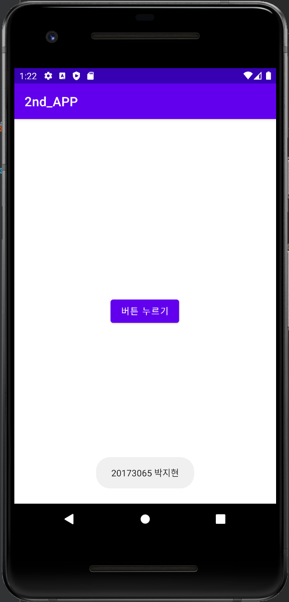</img>
  
## 3주차
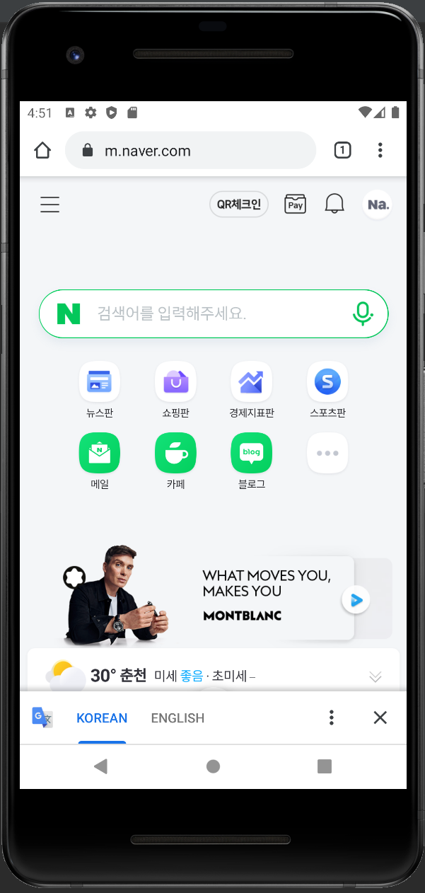</img>
</img>

## 4주차
영화에 대하여 정보와 이야기를 나누는 앱
영화의 가벼운 정보부터 깊은 정보까지.
어떤 영화가 어느 사이트에 있는지 지금 영화관에서 상영 중인지에 대한 여부나 영화 평론이나 관객평 모음집, 또 작품 비하인드 스토리를 비롯한 영화에 관한 다양한 정보를 공유할 수 있는 앱이다.
이 어플을 통해 영화를 단순 유흥거리로 이해하기보다 더욱 깊게 향유할 기회를 얻게 된다.

## 5주차
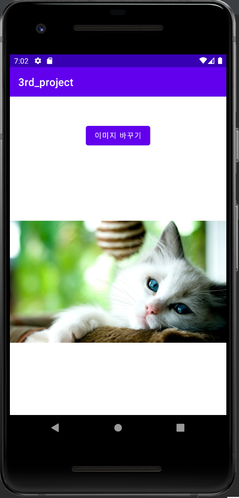</img>
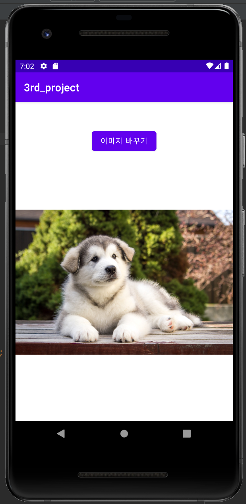</img>

## 6주차
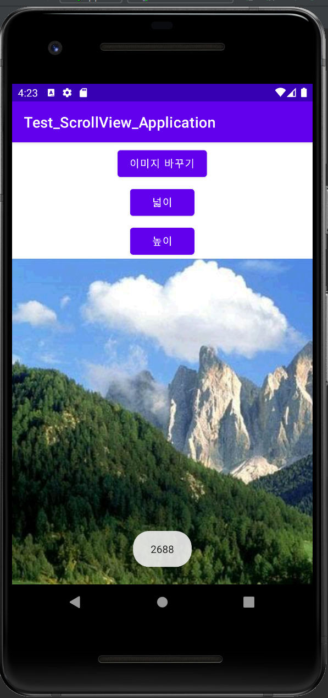</img>
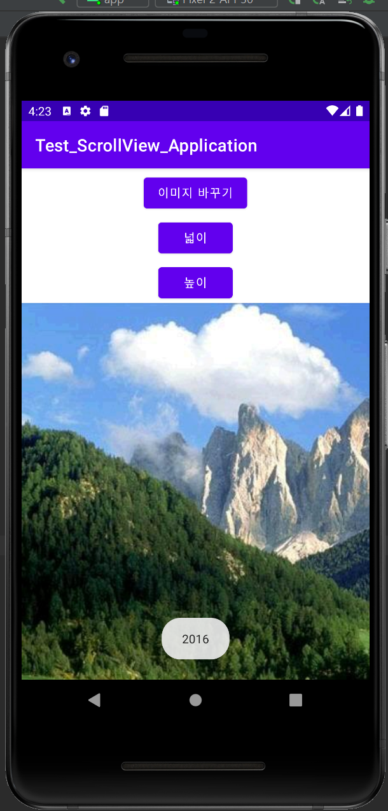</img>
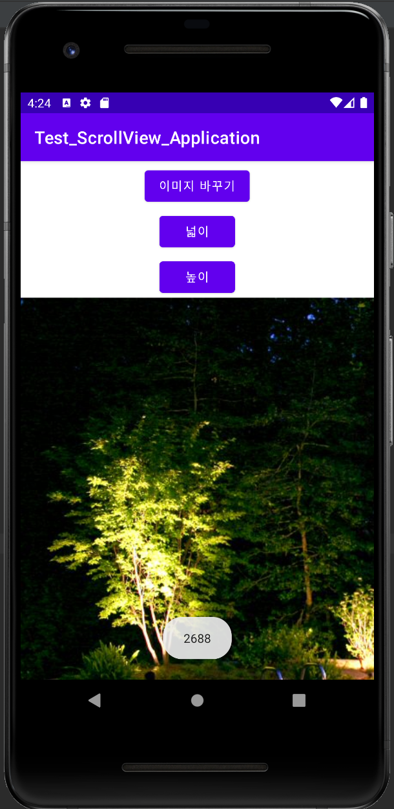</img>
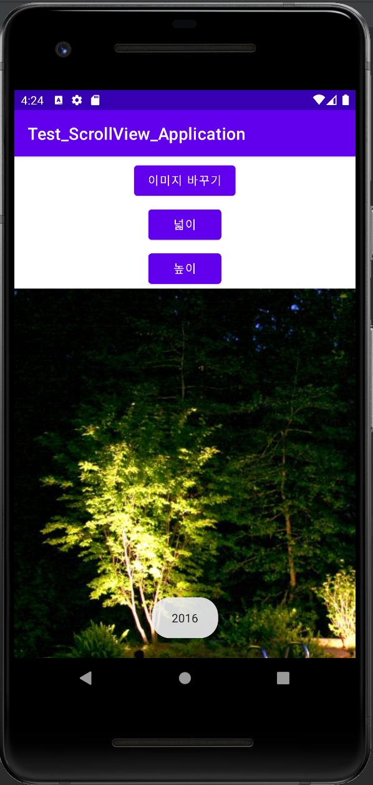</img>

<코딩 수식>

    ScrollView scrollView;
    ImageView imageView;
    BitmapDrawable bitmap;
    String Width;
    String Height;

    @Override
    protected void onCreate(Bundle savedInstanceState) {
        super.onCreate(savedInstanceState);
        setContentView(R.layout.activity_main);

        scrollView = findViewById(R.id.verScrollVIew);
        imageView = findViewById(R.id.imageView);
        scrollView.setHorizontalScrollBarEnabled(true);

        Resources res = getResources();
        bitmap = (BitmapDrawable) res.getDrawable(R.drawable.image01);
        int bitmapWidth = bitmap.getIntrinsicWidth();
        int bitmapHeight = bitmap.getIntrinsicHeight();

        Width = Integer.toString(bitmapWidth);
        Height = Integer.toString(bitmapHeight);

        imageView.setImageDrawable(bitmap);
        imageView.getLayoutParams().width = bitmapWidth;
        imageView.getLayoutParams().height = bitmapHeight;

    }
    public void btnClicked(View v)
    {
        changeImage();
    }
    private void changeImage()
    {
        Resources res = getResources();
        bitmap = (BitmapDrawable) res.getDrawable(R.drawable.image02);
        int bitmapWidth = bitmap.getIntrinsicWidth();
        int bitmapHeight = bitmap.getIntrinsicHeight();

        imageView.setImageDrawable(bitmap);
        imageView.getLayoutParams().width = bitmapWidth;
        imageView.getLayoutParams().height = bitmapHeight;
    }
    public void btnWClicked(View v)
    {
        Toast.makeText(this,Width,Toast.LENGTH_LONG).show();
    }
    public void btnHClicked(View v)
    {
        Toast.makeText(this,Height,Toast.LENGTH_LONG).show();
    }

## 7주차
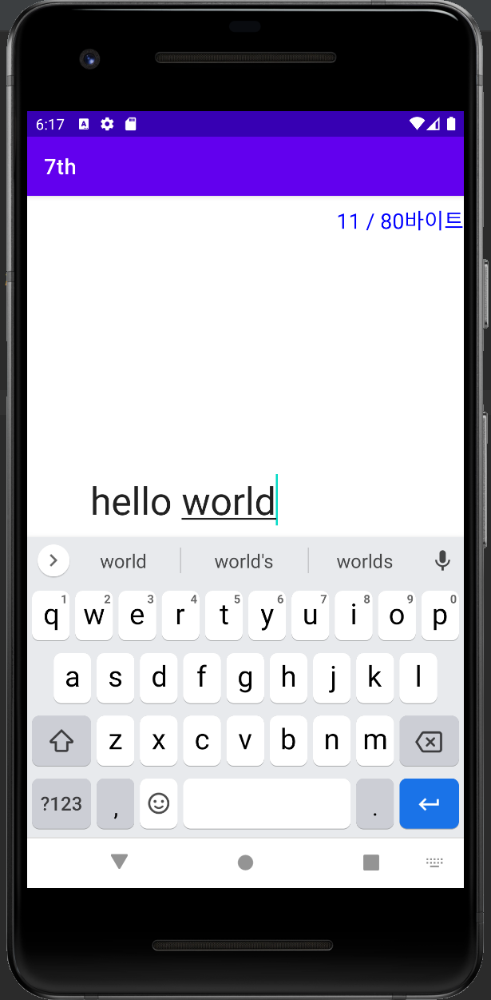</img>

<activity_main.xml>

<?xml version="1.0" encoding="utf-8"?>
<LinearLayout xmlns:android="http://schemas.android.com/apk/res/android"
    xmlns:app="http://schemas.android.com/apk/res-auto"
    xmlns:tools="http://schemas.android.com/tools"
    android:layout_width="match_parent"
    android:layout_height="match_parent"
    android:orientation="vertical"
    tools:context=".MainActivity">

    <LinearLayout
        android:layout_width="match_parent"
        android:layout_height="match_parent"
        android:layout_weight="1"
        android:orientation="vertical">

        <TextView
            android:id="@+id/xinputCount"
            android:layout_width="wrap_content"
            android:layout_height="wrap_content"
            android:text="0 / 80 바이트"
            android:layout_gravity="right"
            android:layout_marginTop="10dp"
            android:textColor="#ff0000ff"
            android:textSize="20sp" />

        <EditText
            android:id="@+id/xinputMessage"
            android:layout_width="300dp"
            android:layout_height="500dp"
            android:layout_gravity="center_horizontal"
            android:maxLength="80"
            android:textSize="36sp" />
    </LinearLayout>

    <LinearLayout
        android:layout_width="match_parent"
        android:layout_height="match_parent"
        android:gravity="center"
        android:layout_weight="3"
        android:orientation="horizontal">

        <Button
            android:id="@+id/xsendButton"
            android:layout_width="wrap_content"
            android:layout_height="wrap_content"
            android:layout_gravity="top"
            android:layout_margin="20dp"
            android:paddingLeft="20dp"
            android:paddingRight="20dp"
            android:text="전송"
            android:textSize="18sp" />

        <Button
            android:id="@+id/xcloseButton"
            android:layout_width="wrap_content"
            android:layout_height="wrap_content"
            android:layout_gravity="top"
            android:layout_margin="20dp"
            android:paddingLeft="20dp"
            android:paddingRight="20dp"
            android:text="닫기"
            android:textSize="18sp" />
    </LinearLayout>
</LinearLayout>

<Activity_Main.java>

    @Override
    protected void onCreate(Bundle savedInstanceState) {
        super.onCreate(savedInstanceState);
        setContentView(R.layout.activity_main);

        jinputMessage = findViewById(R.id.xinputMessage);
        jinputCount = findViewById(R.id.xinputCount);

        Button jsendButton = findViewById(R.id.xsendButton);
        jsendButton.setOnClickListener(new View.OnClickListener() {
            @Override
            public void onClick(View view) {
                String message = jinputMessage.getText().toString();
                Toast.makeText(getApplicationContext(),"전송할 메시지\n\n"+message,Toast.LENGTH_LONG).show();
            }
        });

        Button jcloseButton = findViewById(R.id.xcloseButton);
        jcloseButton.setOnClickListener(new View.OnClickListener(){
            public void onClick(View v){
                finish();
            }
        });
        TextWatcher watcher = new TextWatcher() {
            @Override
            public void beforeTextChanged(CharSequence charSequence, int i, int i1, int i2) {

            }

            @Override
            public void onTextChanged(CharSequence str, int i, int i1, int i2) {
                byte[] bytes = null;
                try {
                    bytes = str.toString().getBytes("KSC5601");
                    int strCount = bytes.length;
                    jinputCount.setText(strCount +" / 80바이트");

                }catch (UnsupportedEncodingException ex){
                    ex.printStackTrace();
                }
            }

            @Override
            public void afterTextChanged(Editable strEditable) {
                String str = strEditable.toString();
                try{
                    byte[] strBytes = str.getBytes("KSC5601");
                    if(strBytes.length > 80){
                        strEditable.delete(strEditable.length()-2, strEditable.length()-1);
                    }
                } catch (Exception ex) {
                    ex.printStackTrace();
                }

            }
        };
        jinputMessage.addTextChangedListener(watcher);
    }
}

## 9주차
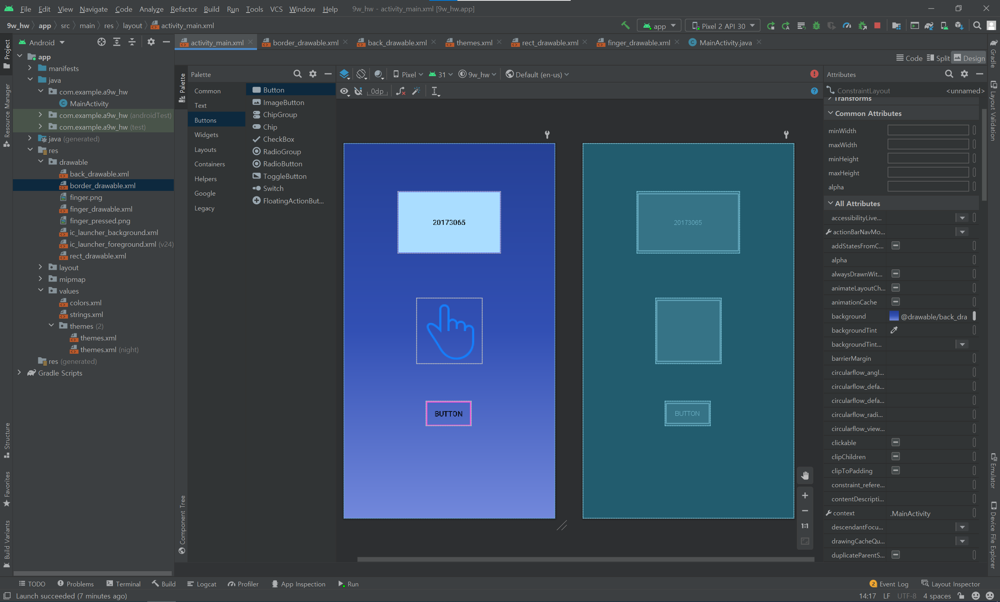</img>

## 10주차
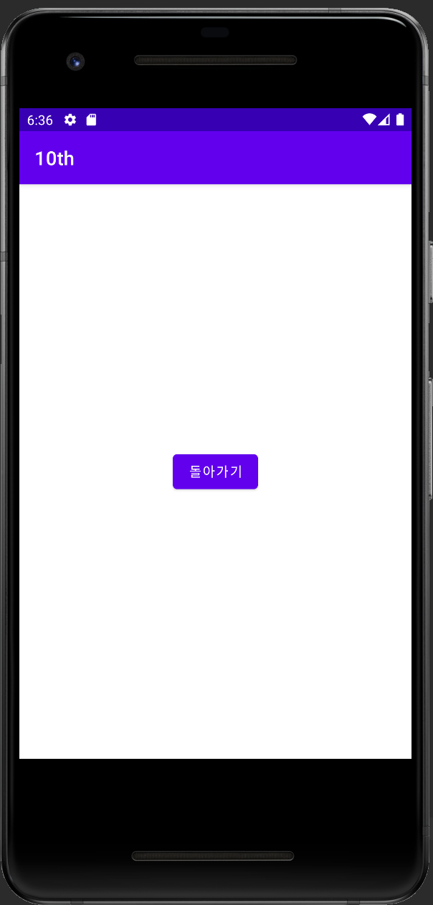</img>
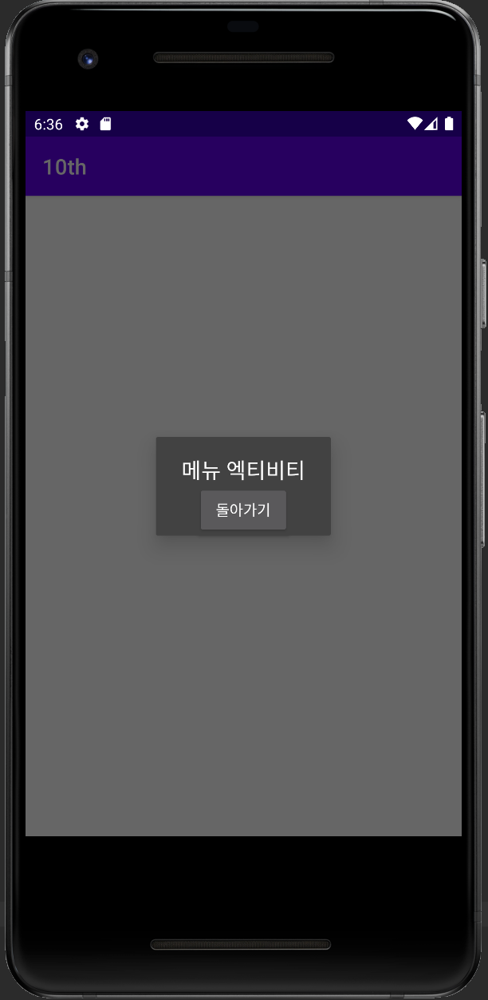</img>
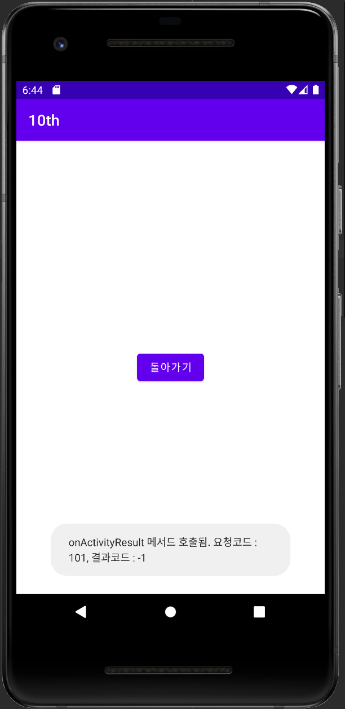</img>
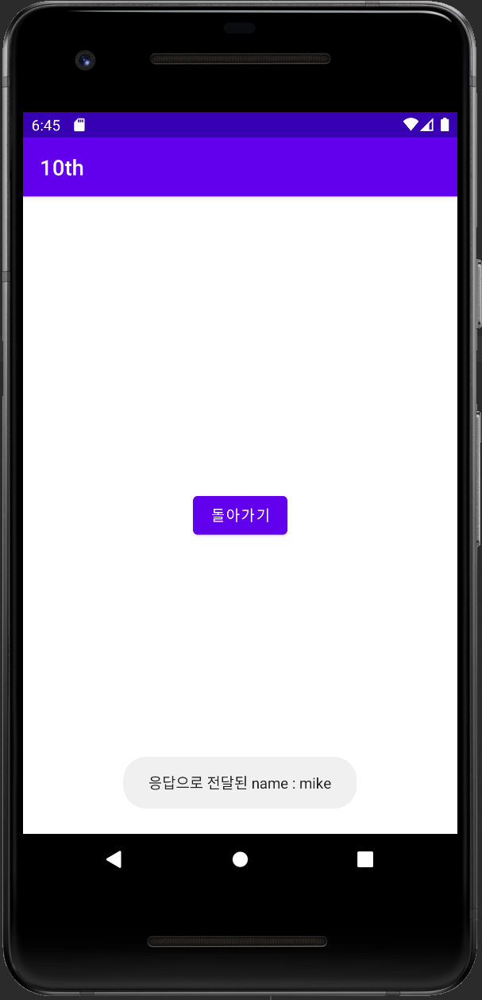</img>

## 11주차
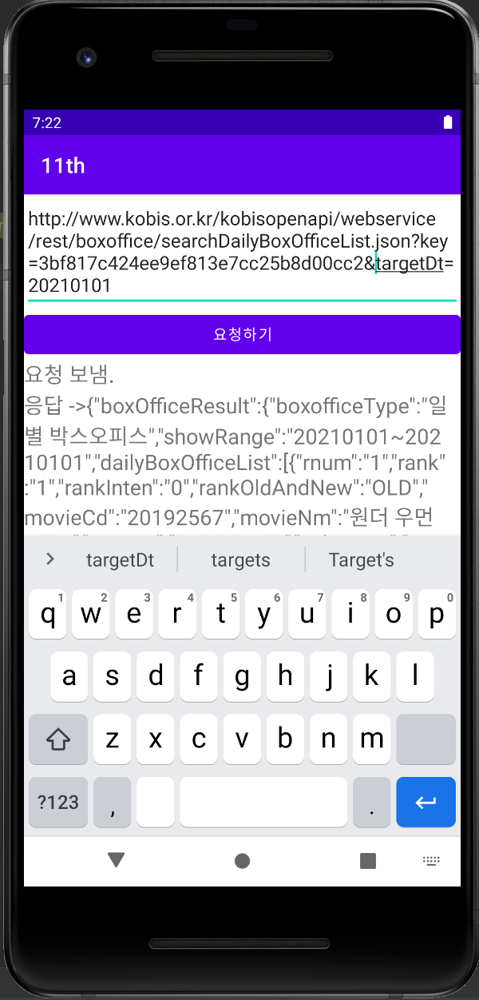</img>

## 12주차
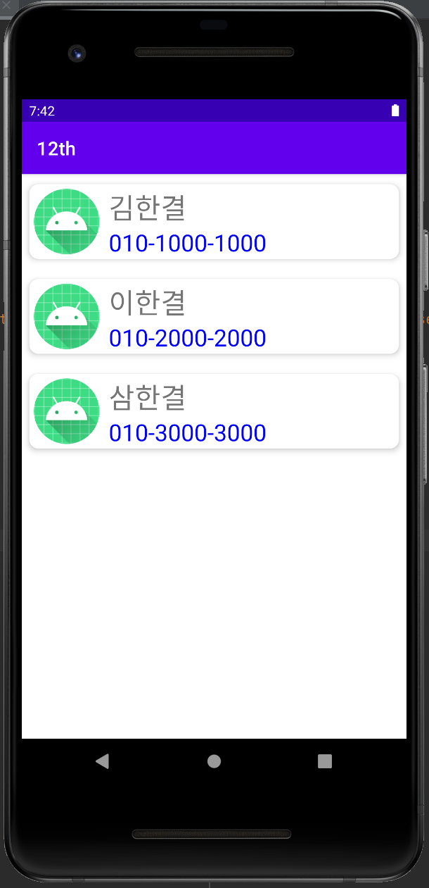</img>

## 13주차
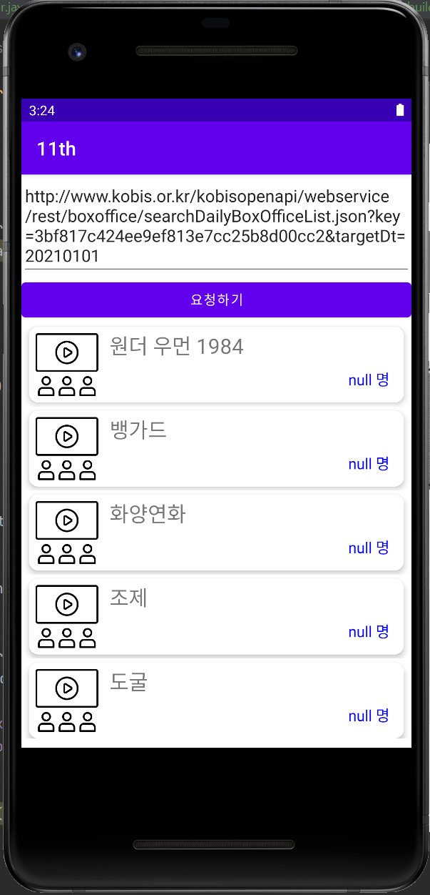</img>
