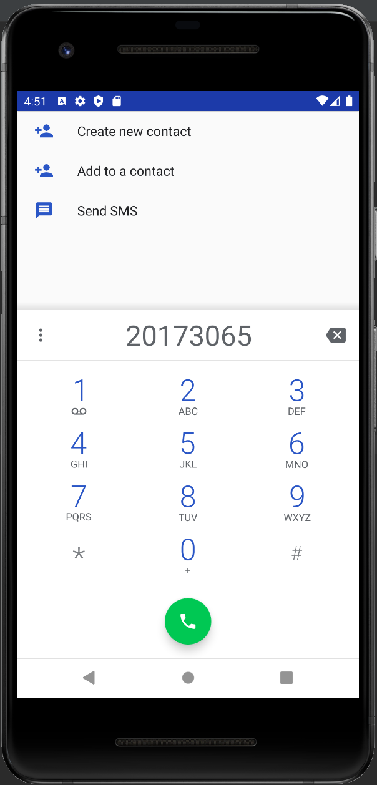

# 20173065_pjh_androidApp

## 1주차

## 2주차
  - Github 사용법
  - 안드로이드앱 프로그래밍 시작
    - Toast 알림
    - AVD 시작하기

</img>
  
## 3주차
</img>
</img>

## 4주차
영화에 대하여 정보와 이야기를 나누는 앱
영화의 가벼운 정보부터 깊은 정보까지.
어떤 영화가 어느 사이트에 있는지 지금 영화관에서 상영 중인지에 대한 여부나 영화 평론이나 관객평 모음집, 또 작품 비하인드 스토리를 비롯한 영화에 관한 다양한 정보를 공유할 수 있는 앱이다.
이 어플을 통해 영화를 단순 유흥거리로 이해하기보다 더욱 깊게 향유할 기회를 얻게 된다.

## 5주차
</img>
</img>

## 6주차
</img>
</img>
</img>
</img>

<코딩 수식>

    ScrollView scrollView;
    ImageView imageView;
    BitmapDrawable bitmap;
    String Width;
    String Height;

    @Override
    protected void onCreate(Bundle savedInstanceState) {
        super.onCreate(savedInstanceState);
        setContentView(R.layout.activity_main);

        scrollView = findViewById(R.id.verScrollVIew);
        imageView = findViewById(R.id.imageView);
        scrollView.setHorizontalScrollBarEnabled(true);

        Resources res = getResources();
        bitmap = (BitmapDrawable) res.getDrawable(R.drawable.image01);
        int bitmapWidth = bitmap.getIntrinsicWidth();
        int bitmapHeight = bitmap.getIntrinsicHeight();

        Width = Integer.toString(bitmapWidth);
        Height = Integer.toString(bitmapHeight);

        imageView.setImageDrawable(bitmap);
        imageView.getLayoutParams().width = bitmapWidth;
        imageView.getLayoutParams().height = bitmapHeight;

    }
    public void btnClicked(View v)
    {
        changeImage();
    }
    private void changeImage()
    {
        Resources res = getResources();
        bitmap = (BitmapDrawable) res.getDrawable(R.drawable.image02);
        int bitmapWidth = bitmap.getIntrinsicWidth();
        int bitmapHeight = bitmap.getIntrinsicHeight();

        imageView.setImageDrawable(bitmap);
        imageView.getLayoutParams().width = bitmapWidth;
        imageView.getLayoutParams().height = bitmapHeight;
    }
    public void btnWClicked(View v)
    {
        Toast.makeText(this,Width,Toast.LENGTH_LONG).show();
    }
    public void btnHClicked(View v)
    {
        Toast.makeText(this,Height,Toast.LENGTH_LONG).show();
    }

